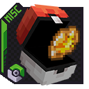

  

    <b>A Cobblemon Addon that bring Item Balls from traditional Pokémon games to Minecraft!</b>

    
    

    

 

 

 

<h3>
 <strong>
Item Balls
 </strong>
</h3>

There are 3 rarities of Item Balls. Common, Uncommon, and Rare. They contain Poké Balls, XP Candies, Apricorn Seeds, Medicine, Evolution Stones, and more! You will randomly come across them on your journey, so make sure to explore every nook and cranny!

 

<h3>
 <strong>
How to Install
 </strong>
</h3>

You must put the downloaded .zip file in your world's "datapack" folder. (Singleplayer world folder, or Multiplayer world folder on Servers).

 

    
    &nbsp;&nbsp;
    

DanMizu&copy;

